Dequa

Passo a passo para instalação:

Clone este repositório através da linha de comando:

git clone [git@github.com](mailto:git@github.com):matheusmcz/Dequa.git

Instalando as dependências:

Acesse a pasta raiz do projeto e rode o comando:

`yarn` ou `npm install`

Dependências:

Aplicação desenvolvida em `React JS`

Utilizando:

`Typescript`, 

`styled-components` (para estilização), 

`axios` (para integração com api),

`react-router-dom` (utilização de rotas ),

`date-fns` (formato das datas),

`react-toastify` (mensagens de sucesso, info, aviso e erro),

 `HandTalk` tradutor de libras,

**Available Scripts**

No diretório do projeto você pode rodar o codigo:

### **`yarn start`**

Roda o projeto em modo de desenvolvimento. Abra [http://localhost:3000](http://localhost:3000/) para visualização no browser.

Utilizado API [https://dequa.herokuapp.com](https://dequa.herokuapp.com/) |  

link do postman [https://documenter.getpostman.com/view/13464744/TzXwEdjw#268812f7-16ea-42a5-8ede-1cd07a1117a1](https://documenter.getpostman.com/view/13464744/TzXwEdjw#268812f7-16ea-42a5-8ede-1cd07a1117a1)

Usabilidade:

Home

  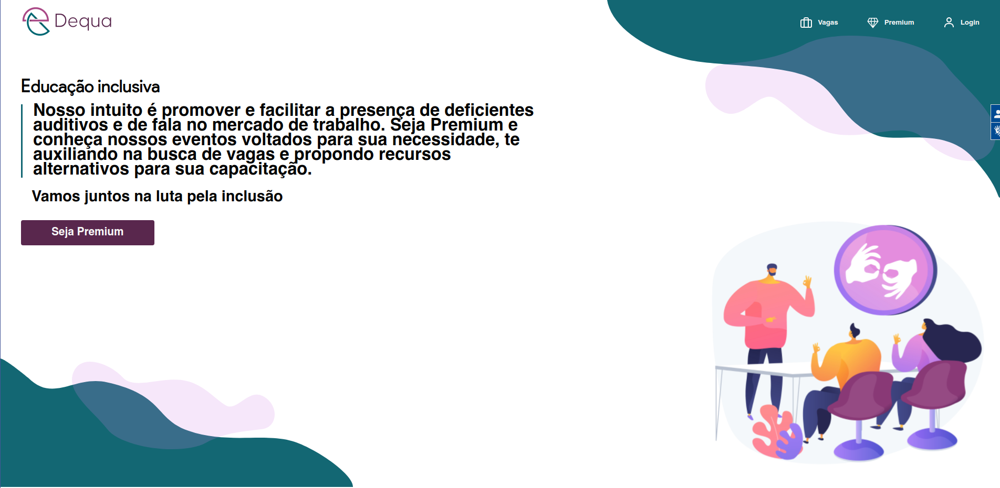

A página principal da aplicação apresenta um icone de log-in:

Ao clicar no icone > você deve realizar o cadastro > realizar login

  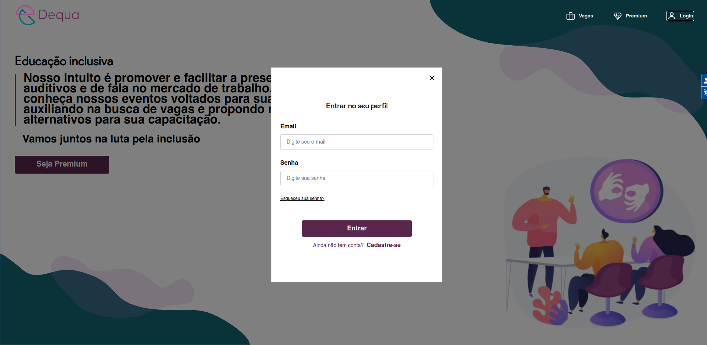

Cadastro:

  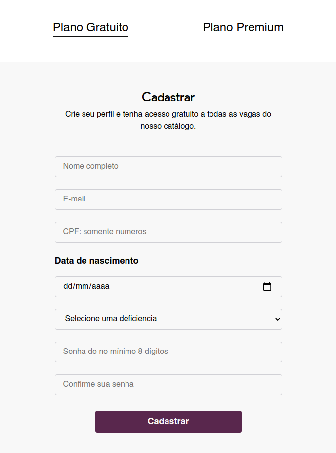

  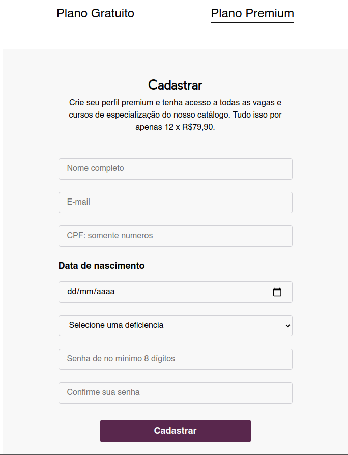

Pagina de pagamento: path: cadastro premium > pagamento

  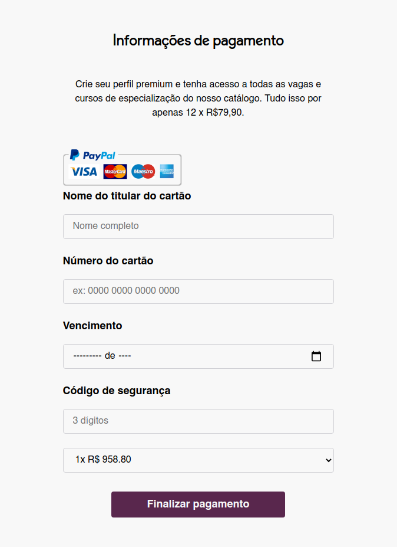

WebView pagina de vagas:

  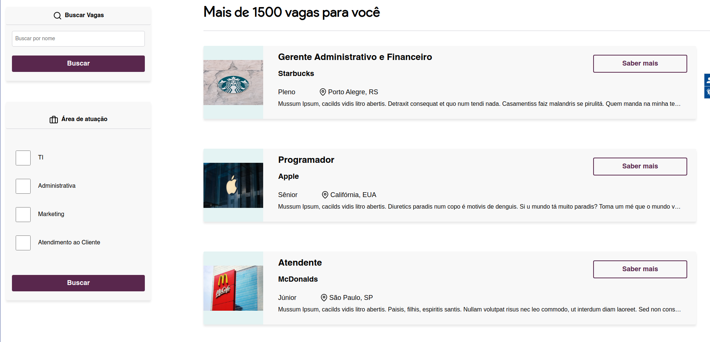

Webview pagina da vaga:

  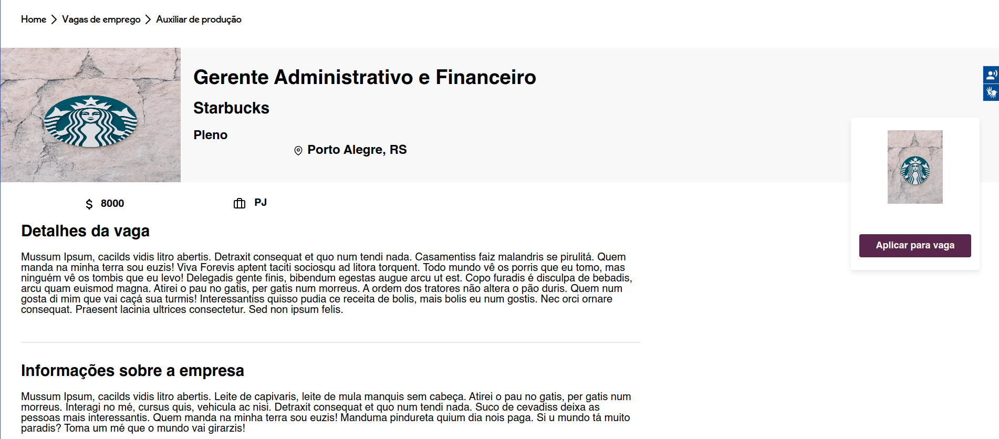

Funcionalidade de aplicar para vaga: 

  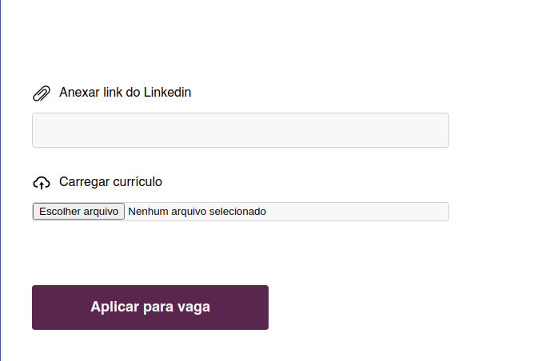

Mesagens de feedback

  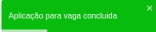

  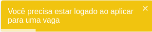

Dashboard de eventos possui as mesmas funcionalidades de vagas, com o detalhe de que ao invés de aplicar para o evento o usuário PREMIUM (apenas) pode inscrever-se no evento.

## ScrenShots mobile:

  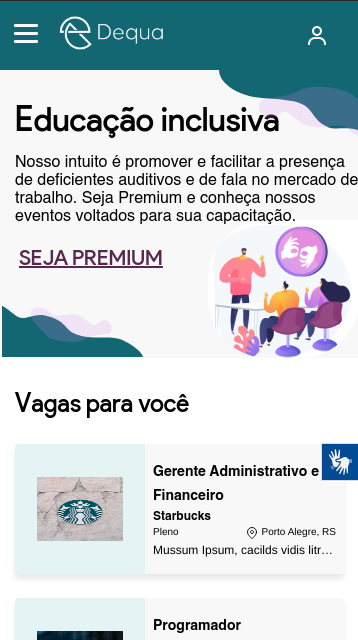

  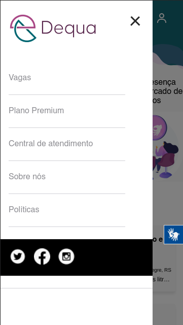

  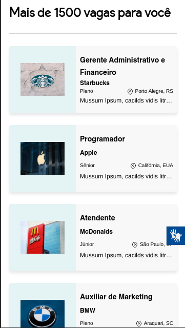

  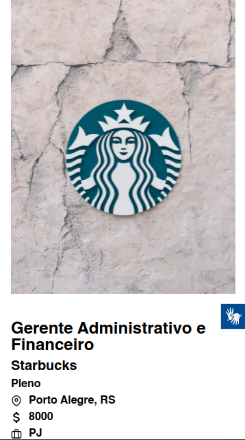

HandTalk (tradutor de libras):

  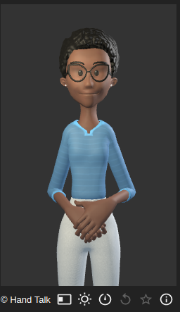

